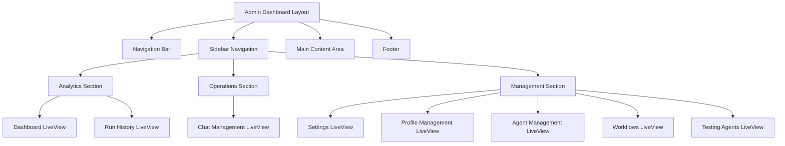

# Design Document: Admin Dashboard

## Overview

The Admin Dashboard is a comprehensive enterprise-grade administrative interface built using Phoenix LiveView, Tailwind CSS, and DaisyUI. It provides a unified interface for managing agents, workflows, system operations, and analytics through a professional three-section layout with navigation bar, sidebar, and footer.

The design leverages the existing Phoenix LiveView architecture and extends the current AgentWebWeb structure with new LiveView components for each administrative section. The interface follows modern enterprise UI/UX patterns with responsive design, accessibility compliance, and real-time updates.

## Architecture

### High-Level Structure



### Phoenix LiveView Integration

The admin dashboard integrates with the existing Phoenix application structure:

- **Router Integration**: New admin routes under `/admin` scope
- **Layout System**: Custom admin layout extending existing `Layouts` module
- **Component Reuse**: Leverages existing `CoreComponents` and creates new admin-specific components
- **Context Integration**: Connects to existing Phoenix contexts for data access

## Components and Interfaces

### 1. Admin Layout Component (`AdminLayout`)

**Purpose**: Main layout wrapper providing consistent structure across all admin pages.

**Key Features**:
- Responsive grid layout with sidebar and main content
- Theme support (light/dark) using existing theme toggle
- Flash message integration
- Breadcrumb navigation
- User session management

**Interface**:
```elixir
def admin_layout(assigns) do
  # Renders: navbar + sidebar + main content + footer
end
```

### 2. Admin Sidebar Component (`AdminSidebar`)

**Purpose**: Left navigation panel with organized menu sections.

**Key Features**:
- Collapsible on mobile devices
- Active state management for current page
- Three main sections: Analytics, Operations, Management
- Icon integration using Heroicons
- Smooth hover animations

**Interface**:
```elixir
def admin_sidebar(assigns) do
  # Renders: collapsible sidebar with navigation sections
end
```

### 3. Analytics Section Components

#### Dashboard LiveView (`AdminDashboardLive`)
- System metrics and KPI cards
- Usage charts and graphs
- Real-time data updates via PubSub
- Date range filtering

#### Run History LiveView (`AdminRunHistoryLive`)
- Paginated execution history table
- Advanced filtering and search
- Export functionality
- Detailed run information modal

### 4. Operations Section Components

#### Chat Management LiveView (`AdminChatLive`)
- Active chat sessions monitoring
- Chat history and analytics
- User interaction management
- Real-time chat updates

### 5. Management Section Components

#### Settings LiveView (`AdminSettingsLive`)
- System configuration management
- Feature toggles and preferences
- Environment variable management
- Configuration validation

#### Profile Management LiveView (`AdminProfilesLive`)
- User profile CRUD operations
- Role and permission management
- Bulk operations support
- Profile activity tracking

#### Agent Management LiveView (`AdminAgentsLive`)
- Agent configuration and deployment
- Agent performance monitoring
- Version management
- Agent testing integration

#### Workflows LiveView (`AdminWorkflowsLive`)
- Workflow definition and editing
- Workflow execution monitoring
- Template management
- Workflow analytics

#### Testing Agents LiveView (`AdminTestingLive`)
- Test suite management
- Test execution and results
- Performance benchmarking
- Test report generation

## Data Models

### Admin Navigation State
```elixir
%{
  current_section: :analytics | :operations | :management,
  current_page: atom(),
  breadcrumbs: [%{label: string(), path: string()}],
  user_permissions: [atom()],
  sidebar_collapsed: boolean()
}
```

### Dashboard Metrics
```elixir
%{
  total_runs: integer(),
  active_sessions: integer(),
  system_health: :healthy | :warning | :critical,
  usage_stats: %{
    daily_executions: integer(),
    monthly_executions: integer(),
    average_response_time: float()
  },
  recent_activities: [%{
    type: atom(),
    timestamp: DateTime.t(),
    description: string(),
    user_id: string()
  }]
}
```

### System Configuration
```elixir
%{
  feature_flags: %{atom() => boolean()},
  system_limits: %{
    max_concurrent_runs: integer(),
    max_file_size: integer(),
    session_timeout: integer()
  },
  integrations: %{
    llm_providers: [%{name: string(), enabled: boolean()}],
    external_apis: [%{name: string(), status: atom()}]
  }
}
```

## Correctness Properties

*A property is a characteristic or behavior that should hold true across all valid executions of a system-essentially, a formal statement about what the system should do. Properties serve as the bridge between human-readable specifications and machine-verifiable correctness guarantees.*

### Property 1: Navigation Consistency
*For any* navigation link in the admin dashboard, clicking the link should navigate to the corresponding view and update the active state appropriately.
**Validates: Requirements 2.2, 2.3, 3.2, 4.2, 4.3, 4.4, 4.5, 4.6**

### Property 2: LiveView State Management
*For any* user interaction with LiveView components, the component state should be maintained correctly and navigation should occur without full page reloads.
**Validates: Requirements 5.2, 5.3, 5.4**

### Property 3: Real-time Data Updates
*For any* data change in the system, components that display real-time information should update automatically via PubSub without user intervention.
**Validates: Requirements 2.5, 3.5, 5.5, 8.3**

### Property 4: Data Integration and Display
*For any* admin section that displays system data, the data should be successfully retrieved from Phoenix contexts and displayed in the appropriate format.
**Validates: Requirements 2.4, 3.3, 8.1**

### Property 5: Responsive Design Behavior
*For any* screen size change, the admin dashboard should adapt its layout appropriately, with the sidebar collapsing on smaller screens and maintaining usability.
**Validates: Requirements 6.1, 6.2**

### Property 6: Error Handling and User Feedback
*For any* error condition or loading state, the admin dashboard should display appropriate feedback messages and handle the condition gracefully.
**Validates: Requirements 8.2, 8.4**

### Property 7: Accessibility and Keyboard Navigation
*For any* interactive element in the admin dashboard, it should be accessible via keyboard navigation and include proper ARIA labels and semantic HTML.
**Validates: Requirements 6.4, 6.5**

### Property 8: Visual Consistency and Styling
*For any* admin dashboard component, it should use consistent Tailwind CSS classes, DaisyUI components, and implement appropriate hover effects and transitions.
**Validates: Requirements 7.1, 7.2, 7.3, 7.4**

### Property 9: Performance with Large Datasets
*For any* data display that could contain large datasets, the system should implement pagination or streaming to maintain performance.
**Validates: Requirements 8.5**

## Error Handling

### Client-Side Error Handling
- **Network Failures**: Display user-friendly error messages for connection issues
- **Invalid User Input**: Provide immediate validation feedback with clear error descriptions
- **Permission Errors**: Show appropriate access denied messages with guidance
- **Loading Timeouts**: Implement timeout handling with retry options

### Server-Side Error Handling
- **Context Failures**: Graceful degradation when data contexts are unavailable
- **Database Errors**: Proper error logging with user-friendly messages
- **PubSub Failures**: Fallback to polling when real-time updates fail
- **Authentication Errors**: Redirect to login with session preservation

### Error Recovery Strategies
- **Automatic Retry**: For transient network and server errors
- **Graceful Degradation**: Disable features that depend on failed services
- **User Notification**: Clear communication about system status and recovery actions
- **Error Logging**: Comprehensive logging for debugging and monitoring

## Testing Strategy

### Dual Testing Approach
The admin dashboard will use both unit testing and property-based testing for comprehensive coverage:

- **Unit Tests**: Verify specific examples, edge cases, and error conditions
- **Property Tests**: Verify universal properties across all inputs using StreamData
- Both approaches are complementary and necessary for comprehensive coverage

### Unit Testing Focus Areas
- Specific navigation examples and edge cases
- Integration points between LiveView components
- Error conditions and boundary cases
- Component rendering with specific data sets

### Property-Based Testing Configuration
- **Library**: StreamData (Elixir's property-based testing library)
- **Minimum Iterations**: 100 iterations per property test
- **Test Tags**: Each property test references its design document property
- **Tag Format**: **Feature: admin-dashboard, Property {number}: {property_text}**

### Property Test Implementation
Each correctness property will be implemented as a single property-based test:

1. **Property 1 Test**: Generate random navigation scenarios and verify correct routing
2. **Property 2 Test**: Generate random user interactions and verify state management
3. **Property 3 Test**: Generate random data changes and verify real-time updates
4. **Property 4 Test**: Generate random data sets and verify display formatting
5. **Property 5 Test**: Generate random screen sizes and verify responsive behavior
6. **Property 6 Test**: Generate random error conditions and verify error handling
7. **Property 7 Test**: Generate random UI elements and verify accessibility
8. **Property 8 Test**: Generate random components and verify styling consistency
9. **Property 9 Test**: Generate large datasets and verify performance optimizations

### Integration Testing
- **LiveView Integration**: Test complete user workflows across multiple components
- **Phoenix Context Integration**: Verify data flow from contexts to UI components
- **PubSub Integration**: Test real-time updates across multiple browser sessions
- **Authentication Integration**: Verify proper access control and session management
