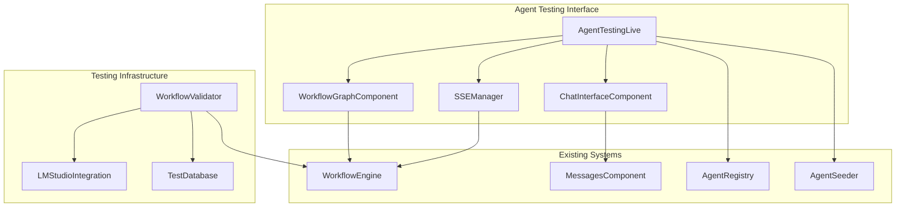

# Design Document

## Overview

The Agent Testing Interface is a comprehensive LiveView-based system that provides developers with tools to validate agent behavior through both manual testing and automated workflow validation. The system integrates with the existing workflow engine, message components, and SSE infrastructure to create a unified testing environment.

**Workflow-Only Architecture**: The system is designed around workflows as the primary execution mechanism. Plans have been phased out in favor of workflows that provide more reliable and consistent responses. All functionality operates directly with workflows without fallback to plan-based execution.

The interface consists of three main components: a workflow graph visualization system that displays execution steps and their real-time status, a chat interface that reuses existing message components for testing agent responses, and an automated validation system that runs integration tests against LM Studio with predefined scenarios.

## Architecture

The system follows a modular architecture that leverages existing Phoenix LiveView infrastructure and integrates with the current workflow engine and agent systems.



## Components and Interfaces

### AgentTestingLive

The main LiveView module that orchestrates the testing interface.

**State Management:**
- `selected_agent`: Currently selected agent for testing
- `available_agents`: List of agents available for testing
- `workflow_graph`: Current workflow structure and execution state
- `chat_messages`: Conversation history using existing message format
- `sse_connection`: Server-sent events connection for real-time updates
- `execution_status`: Current workflow execution state

**Key Functions:**
- `mount/3`: Initialize the testing interface and load available agents
- `handle_event("select_agent", params, socket)`: Switch to a different agent
- `handle_event("send_message", params, socket)`: Send test message to agent
- `handle_event("seed_agents", params, socket)`: Create test agents when none exist
- `handle_info({:sse_update, data}, socket)`: Process real-time workflow updates

### WorkflowGraphComponent

A reusable component for visualizing workflow execution graphs.

**Props:**
- `workflow_spec`: The workflow specification to visualize
- `execution_state`: Current execution status of each node
- `current_step`: Currently executing step (highlighted)

**Rendering Logic:**
- Displays workflow nodes as interactive elements
- Shows connections between nodes based on workflow edges
- Updates node colors based on execution status (pending, running, completed, failed)
- Provides hover tooltips with step details and execution times

### ChatInterfaceComponent

A wrapper component that integrates the existing `AgentWebWeb.MessagesComponent` with agent testing functionality.

**Integration Points:**
- Reuses `AgentWebWeb.MessagesComponent` for message rendering and streaming
- Maintains compatibility with existing SSE streaming infrastructure
- Leverages built-in markdown rendering and message formatting
- Uses existing streaming buffer and token handling

**Enhanced Features:**
- Agent selection indicator in chat header
- Workflow execution progress indicators
- Conversation context management and history
- Enhanced error handling with recovery options
- Agent-specific metadata in messages (agent_id, workflow_id, execution_time)

### SSEManager (AgentWeb.Streaming.SseManager)

Leverages the existing SSE infrastructure for real-time streaming responses.

**Integration Points:**
- Uses existing `/api/agents/execute/stream` endpoint
- Handles SSE events: `sse_token`, `sse_done`, `sse_error`, `sse_clarify`
- Integrates with AgentRuntime.Llm.StreamEvent for event definitions
- Provides automatic connection management and error handling

**Event Types:**
- `sse_token`: Streaming token chunks during response generation
- `sse_done`: Completion with metadata (run_id, trace_id, usage, latency)
- `sse_error`: Error conditions with structured error information
- `sse_clarify`: Clarification requests from agents
- `sse_ping`: Keep-alive events for connection maintenance

## Data Models

### AgentTestingState

```elixir
defmodule AgentTestingState do
  @type t :: %__MODULE__{
    selected_agent_id: String.t() | nil,
    available_agents: [Agent.t()],
    workflow_graph: WorkflowGraph.t() | nil,
    chat_messages: [Message.t()],
    execution_status: ExecutionStatus.t(),
    sse_connection_id: String.t() | nil,
    loading: boolean(),
    error: String.t() | nil
  }
  
  defstruct [
    :selected_agent_id,
    :available_agents,
    :workflow_graph,
    :chat_messages,
    :execution_status,
    :sse_connection_id,
    :loading,
    :error
  ]
end
```

### WorkflowGraph

```elixir
defmodule WorkflowGraph do
  @type node_status :: :pending | :running | :completed | :failed
  
  @type node :: %{
    id: String.t(),
    name: String.t(),
    status: node_status(),
    execution_time_ms: integer() | nil,
    error: String.t() | nil
  }
  
  @type edge :: %{
    from: String.t(),
    to: String.t(),
    condition: String.t() | nil
  }
  
  @type t :: %__MODULE__{
    nodes: [node()],
    edges: [edge()],
    current_step: String.t() | nil,
    execution_trace: [String.t()]
  }
  
  defstruct [:nodes, :edges, :current_step, :execution_trace]
end
```

### ExecutionStatus

```elixir
defmodule ExecutionStatus do
  @type status :: :idle | :running | :completed | :failed
  
  @type t :: %__MODULE__{
    status: status(),
    started_at: DateTime.t() | nil,
    completed_at: DateTime.t() | nil,
    total_steps: integer(),
    completed_steps: integer(),
    current_step_name: String.t() | nil
  }
  
  defstruct [
    :status,
    :started_at,
    :completed_at,
    :total_steps,
    :completed_steps,
    :current_step_name
  ]
end
```

## Agent Management

### AgentRegistry Integration

The system integrates with the existing agent registry to discover and manage available agents.

**Agent Discovery:**
- Query existing agent registry for available agents
- Filter agents based on testing compatibility
- Provide fallback when no agents are available

**Agent Selection:**
- Allow users to switch between available agents
- Maintain agent-specific conversation history
- Reset workflow state when switching agents

### AgentSeeder

Creates test agents when none are available in the system.

**Seeding Strategy:**
- Create a default test agent with RAG_History_Workflow
- Configure agent with appropriate test settings
- Register agent in the existing agent registry
- Provide clear feedback about seeded agent capabilities

**Default Test Agent Configuration:**
```elixir
%Agent{
  id: "test_agent_simple",
  name: "Simple Test Agent",
  description: "Simple test agent for basic testing with workflow execution",
  # Workflow-based configuration (no plan references)
  metadata: %{
    "test_mode" => true,
    "purpose" => "testing"
  },
  profiles: %{
    execution_profile_id: "req_llm",        # Main LLM execution - LM Studio
    assessor_profile_id: "req_llm",         # Assessment steps - LM Studio  
    embeddings_profile_id: "embeddings_nomic_v15" # Embeddings - LM Studio with Nomic
  },
  enabled: true,
  test_mode: true
}
```

## Workflow Integration

### Existing SSE Infrastructure Integration

The system leverages the existing `AgentWeb.Streaming.SseManager` and `/api/agents/execute/stream` endpoint for real-time agent communication.

**Execution Flow:**
1. User sends message through chat interface
2. System converts message to agent execution payload format
3. JavaScript `push_event("sse_start", payload)` initiates SSE streaming
4. `AgentWeb.Streaming.SseManager` handles the streaming lifecycle
5. LiveView handles SSE events (`sse_token`, `sse_done`, `sse_error`, `sse_clarify`)
6. Results are displayed using existing `MessagesComponent` with streaming support

**Integration Points:**
- `AgentRuntime.Llm.Agent.Store` for agent discovery and management
- `AgentWeb.Streaming.SseManager` for streaming communication
- `/api/agents/execute/stream` endpoint for agent execution
- `AgentWebWeb.MessagesComponent` for message rendering and streaming display

### Real-time Monitoring

**SSE Event Stream:**
- Subscribe to agent execution events via existing SSE infrastructure
- Handle streaming tokens for real-time response display
- Process completion events with execution metadata
- Handle error conditions and clarification requests gracefully

**UI Updates:**
- Update message display using existing streaming buffer functionality
- Show execution progress through workflow status indicators
- Display execution metadata (timing, token usage, trace IDs)
- Provide error recovery options for failed executions

## Testing Infrastructure

### WorkflowValidator

Automated testing system that validates workflow behavior with predefined scenarios using the existing provider infrastructure.

**Multi-Profile LM Studio Integration:**
- **Execution Profile**: Uses `req_llm` profile for main LLM responses (LM Studio)
- **Assessor Profile**: Uses `req_llm` profile for assessment steps (LM Studio) 
- **Embeddings Profile**: Uses `embeddings_nomic_v15` profile for RAG operations (LM Studio with Nomic model)
- Leverages agent's configured profiles rather than forcing a single profile
- Automatic health checks through provider `health_check/2` function
- Graceful degradation when LM Studio is unavailable

**Workflow Integration:**
- Uses workflow execution engine directly (no plan fallback)
- Assessment steps determine if conversation history is needed
- Embeddings operations for context retrieval from memory
- Full workflow execution with proper multi-profile routing

**Test Scenarios:**
1. **Context Retention Test**: Validates that agents properly retain and use conversation context
   - Send: "My name is Thanos, what is your name?"
   - Send: "Do you know my name?"
   - Assert: Response contains "Thanos" and is not a clarification request

**Test Execution:**
- Run against isolated test database through existing DataCase infrastructure
- Use real agent execution pipeline with streaming support
- Provide detailed assertion results and failure analysis
- Handle provider-level errors (connection, timeout, unavailability)

### LM Studio Integration (via Existing Provider System)

LM Studio integration is handled through the existing provider architecture with specialized profiles for different operations.

**Multi-Profile Architecture:**
- **Execution Profile** (`req_llm`): Main LLM responses using `openai_compatible` provider → LM Studio
- **Assessor Profile** (`req_llm`): Assessment operations (history need, clarification) → LM Studio  
- **Embeddings Profile** (`embeddings_nomic_v15`): RAG embeddings using Nomic model → LM Studio

**Provider-Based Integration:**
- Uses existing `AgentRuntime.Llm.Providers.OpenAICompatible` provider
- Configured through LLM profiles with `provider: :openai_compatible`
- Automatic routing to `http://localhost:1234/v1` when LM Studio is running
- Different models per profile (e.g., `openai/gpt-oss-20b` for chat, `text-embedding-nomic-embed-text-v1.5` for embeddings)

**Connection Management:**
- Built-in health checks via provider `health_check/2` function
- Graceful handling of LM Studio unavailability through existing error handling
- Configurable timeouts (60s request, 10s connect) via provider configuration

**Request/Response Handling:**
- Seamless integration through existing agent execution pipeline
- Uses same streaming infrastructure as other providers
- Proper profile routing for different workflow steps
- No special formatting needed - handled by OpenAI-compatible provider

### Test Database Integration

**Isolation Strategy:**
- Use existing test database configuration from `AgentWeb.DataCase`
- Leverage Ecto.Adapters.SQL.Sandbox for transaction isolation
- Ensure test data doesn't interfere with development data
- Clean up test data automatically through existing test infrastructure

**Data Management:**
- Create test conversations and message history through existing stores
- Seed test agents and workflows via `AgentSeeder`
- Manage test user sessions and contexts through existing conversation system

## Correctness Properties

*A property is a characteristic or behavior that should hold true across all valid executions of a system-essentially, a formal statement about what the system should do. Properties serve as the bridge between human-readable specifications and machine-verifiable correctness guarantees.*

### Property 1: Agent Testing Interface Initialization
*For any* user navigation to the agent testing page, the interface should display either available agents for selection or clear instructions for seeding agents when none are available
**Validates: Requirements 1.2, 1.3**

### Property 2: Agent Selection and Loading
*For any* valid agent selection, the interface should load the agent's workflow graph and initialize the chat interface without errors
**Validates: Requirements 1.4**

### Property 3: Error Handling and Recovery
*For any* error condition encountered during interface operation, the system should display helpful error messages and provide recovery options
**Validates: Requirements 1.5**

### Property 4: Workflow Graph Visualization
*For any* workflow specification, the graph component should display all nodes with correct connections and update node status accurately during execution
**Validates: Requirements 2.1, 2.2, 2.3, 2.4, 2.5**

### Property 5: Chat Message Processing
*For any* valid message input, the chat interface should send the message to the selected agent and display responses using the existing Messages_Component
**Validates: Requirements 3.1, 3.2**

### Property 6: Conversation Context Maintenance
*For any* sequence of message exchanges, the chat interface should maintain conversation history and display workflow progress updates
**Validates: Requirements 3.3, 3.4**

### Property 7: Chat Error Display
*For any* agent error condition, the chat interface should display error messages that are clearly distinguishable from normal responses
**Validates: Requirements 3.5**

### Property 8: SSE Connection Management
*For any* workflow execution, the SSE manager should establish connections, broadcast step updates, and handle connection failures with automatic reconnection
**Validates: Requirements 4.1, 4.2, 4.3, 4.4, 4.5**

### Property 9: Agent Seeding Functionality
*For any* agent seeding request, the system should create properly configured test agents and make them available for selection
**Validates: Requirements 5.2, 5.3, 5.5**

### Property 10: Seeding Error Handling
*For any* agent seeding failure, the system should provide clear error messages and troubleshooting guidance
**Validates: Requirements 5.4**

### Property 11: Workflow Validation Isolation
*For any* workflow validation test execution, the system should run against the test database to ensure proper isolation from development data
**Validates: Requirements 6.1**

### Property 12: Validation Failure Reporting
*For any* workflow validation failure, the system should provide detailed failure information including expected vs actual responses
**Validates: Requirements 6.5**

### Property 13: LM Studio Integration via Provider System
*For any* workflow test execution, the system should seamlessly integrate with LM Studio through the existing provider architecture when available
**Validates: Requirements 7.1, 7.3, 7.4, 7.5**

### Property 14: LM Studio Unavailability Handling
*For any* scenario where LM Studio is unavailable, the system should provide clear error messages and handle failures gracefully through existing provider error handling
**Validates: Requirements 7.2**

### Property 15: UI Component Consistency
*For any* interface element (messages, workflow status, errors), the system should use existing components and maintain design consistency
**Validates: Requirements 8.1, 8.2, 8.3, 8.4, 8.5**

## Error Handling

### Error Categories

**Connection Errors:**
- SSE connection failures with automatic retry logic
- LM Studio unavailability with graceful degradation
- Database connection issues with clear error reporting

**Validation Errors:**
- Invalid agent configurations with detailed error messages
- Workflow execution failures with step-level error tracking
- Test assertion failures with expected vs actual comparisons

**User Input Errors:**
- Invalid message formats with input validation feedback
- Agent selection errors with fallback options
- Seeding parameter errors with correction guidance

### Error Recovery Strategies

**Automatic Recovery:**
- SSE connection retry with exponential backoff
- Workflow execution retry for transient failures
- Agent seeding retry with different configurations

**User-Guided Recovery:**
- Clear error messages with actionable next steps
- Alternative workflow suggestions when primary fails
- Manual agent seeding options when automatic fails

## Testing Strategy

### Dual Testing Approach

The system requires both unit tests and property-based tests to ensure comprehensive coverage:

**Unit Tests:**
- Specific UI component rendering and interaction tests
- Integration points between existing and new components
- Edge cases like empty agent lists and connection failures
- Specific test scenarios like the "Thanos" context retention test

**Property-Based Tests:**
- Universal properties that hold across all agent configurations
- Workflow visualization behavior across different workflow structures
- Message handling across various input types and formats
- SSE event handling across different connection states

### Property-Based Testing Configuration

- **Testing Library:** StreamData for Elixir property-based testing
- **Test Iterations:** Minimum 100 iterations per property test
- **Test Tagging:** Each property test tagged with format: **Feature: agent-testing-interface, Property {number}: {property_text}**

### Test Coverage Requirements

**Component-Level Testing:**
- AgentTestingLive: Mount, event handling, state management
- WorkflowGraphComponent: Visualization rendering, status updates
- ChatInterfaceComponent: Message integration, streaming responses
- SSEManager: Connection management, event broadcasting

**Integration Testing:**
- End-to-end agent testing workflows
- Real-time SSE event delivery and UI updates
- LM Studio integration with actual language model responses
- Database isolation and cleanup for validation tests

**Property Testing Focus:**
- Agent selection and workflow loading across all agent types
- Message processing and response handling across all input formats
- Error handling and recovery across all failure scenarios
- UI consistency and component reuse across all interface states