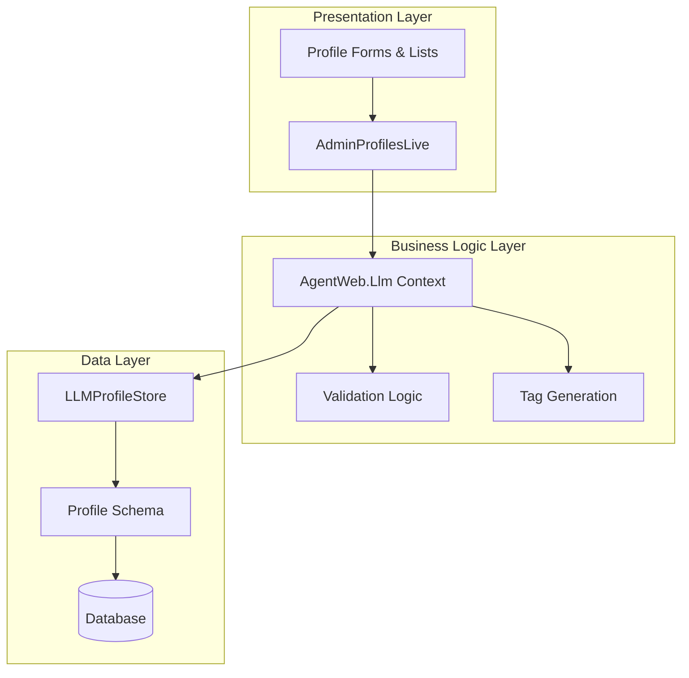

# Design Document

## Overview

The LLM Profile Management system provides a comprehensive administrative interface for managing Large Language Model configurations. The system follows a layered architecture with clear separation between presentation (LiveView), business logic (Context Module), and data persistence (Store Layer).

The design leverages Phoenix LiveView for real-time UI interactions, implements automatic tag generation for intelligent categorization, and provides extensive configuration options for generation parameters, budget limits, and provider-specific settings.

## Architecture

The system follows a three-layer architecture pattern:



### Layer Responsibilities

- **Presentation Layer**: Handles user interactions, form rendering, and real-time updates
- **Business Logic Layer**: Manages profile operations, validation, and tag generation
- **Data Layer**: Provides persistence and data conversion between domain objects and database schemas

## Components and Interfaces

### 1. AdminProfilesLive (LiveView)

The main LiveView component that orchestrates the user interface and handles all user interactions.

**Key Responsibilities:**
- Render profile lists, forms, and detail views
- Handle user events (create, edit, delete, filter, search)
- Manage view state transitions (list ↔ detail ↔ edit ↔ create)
- Coordinate with the context module for data operations

**State Management:**
```elixir
%{
  view_mode: :list | :detail | :edit | :create,
  selected_profile: map() | nil,
  all_profiles: [map()],
  filtered_profiles: [map()],
  search_query: String.t(),
  provider_filter: String.t(),
  status_filter: String.t(),
  profile_stats: map(),
  available_providers: [map()]
}
```

### 2. AgentWeb.Llm Context Module

The business logic layer that provides a stable API for profile operations.

**Core Functions:**
```elixir
@spec create_profile(map()) :: {:ok, LLMProfile.t()} | {:error, String.t()}
@spec update_profile(String.t(), map()) :: {:ok, LLMProfile.t()} | {:error, String.t()}
@spec list_profiles_ui(map()) :: {:ok, [map()]} | {:error, String.t()}
@spec calculate_profile_stats([map()]) :: map()
@spec available_providers() :: [map()]
```

**Tag Generation Logic:**
- Automatic provider-based tags (:openai, :anthropic, :google)
- Model-based tags (gpt-4 → :gpt4, claude-3 → :claude3)
- Feature-based tags (:embeddings, :chat, :vision)
- User-defined manual tags from form input

### 3. LLMProfileStore

The data persistence layer that handles conversion between domain structs and database schemas.

**Interface:**
```elixir
@spec put(LLMProfile.t()) :: {:ok, String.t()} | {:error, Ecto.Changeset.t()}
@spec get(String.t()) :: {:ok, LLMProfile.t()} | :error
@spec list(keyword()) :: [LLMProfile.t()]
@spec delete(String.t()) :: :ok | {:error, term()}
@spec name_available?(String.t()) :: boolean()
```

## Data Models

### LLMProfile Domain Struct

```elixir
%AgentCore.Llm.LLMProfile{
  id: String.t() | nil,
  name: String.t(),
  enabled: boolean(),
  provider: atom(),  # :openai, :anthropic, :google, etc.
  model: String.t(),
  policy_version: String.t(),
  generation: GenerationParams.t(),
  budgets: Budgets.t(),
  tools: [String.t()],
  stop_list: [String.t()],
  tags: [atom()],
  inserted_at: DateTime.t() | nil,
  updated_at: DateTime.t() | nil
}
```

### GenerationParams

```elixir
%AgentCore.Llm.GenerationParams{
  temperature: float(),           # 0.0 - 2.0
  top_p: float(),                # 0.0 - 1.0
  max_output_tokens: integer() | nil,
  seed: integer() | nil,
  presence_penalty: float() | nil,  # -2.0 - 2.0
  frequency_penalty: float() | nil, # -2.0 - 2.0
  stop: [String.t()] | nil
}
```

### Budgets

```elixir
%AgentCore.Llm.Budgets{
  max_input_tokens: integer() | nil,
  max_output_tokens: integer() | nil,
  max_total_tokens: integer() | nil,
  max_cost_eur: float() | nil,
  max_steps: integer() | nil
}
```

### UI Profile Format

The context module converts domain structs to UI-friendly maps:

```elixir
%{
  id: String.t(),
  name: String.t(),
  provider: String.t(),
  model: String.t(),
  status: "active" | "inactive",
  enabled: boolean(),
  temperature: float(),
  max_tokens: integer(),
  tools: [String.t()],
  tags: [atom()],
  created_at: String.t(),
  updated_at: String.t(),
  config: map(),
  usage_stats: map(),
  cost_per_1k_tokens: map()
}
```

## Correctness Properties

*A property is a characteristic or behavior that should hold true across all valid executions of a system-essentially, a formal statement about what the system should do. Properties serve as the bridge between human-readable specifications and machine-verifiable correctness guarantees.*

Now I'll analyze the acceptance criteria to determine which ones are testable as properties:

### Converting EARS to Properties

Based on the prework analysis, I'll convert the testable acceptance criteria into universally quantified properties:

**Property 1: Profile Creation and Persistence**
*For any* valid profile data submitted through the form, the system should create a proper LLMProfile struct and successfully persist it to the database
**Validates: Requirements 1.3, 9.4**

**Property 2: Profile Form Pre-population**
*For any* existing profile selected for editing, the form should be pre-populated with all current values from that profile
**Validates: Requirements 1.4**

**Property 3: Profile Validation**
*For any* profile submission with missing required fields or invalid data types, the system should reject the submission and display appropriate validation errors
**Validates: Requirements 1.5, 7.1, 7.2, 7.4**

**Property 4: Automatic Tag Generation**
*For any* profile created with a provider and model, the system should automatically generate appropriate tags based on provider type, model name patterns (embed→:embeddings, chat→:chat), and combine them with manual tags without duplicates
**Validates: Requirements 2.1, 2.2, 2.3, 2.4, 2.5**

**Property 5: JSON Field Processing**
*For any* JSON input in tools or stop_list fields, the system should parse valid JSON correctly and provide appropriate defaults or error messages for invalid JSON
**Validates: Requirements 5.1, 5.2, 7.3, 9.2**

**Property 6: Form Data Conversion**
*For any* form submission, the system should correctly convert string inputs to appropriate data types (provider strings to atoms, numeric strings to floats/integers, comma-separated tags to lists)
**Validates: Requirements 5.3, 9.1, 9.3, 10.2**

**Property 7: Domain to UI Conversion**
*For any* LLMProfile domain object, the context module should convert it to a properly formatted UI map with all required fields and correct data types
**Validates: Requirements 6.5**

**Property 8: Profile Filtering**
*For any* set of profiles and filter criteria (provider, status), the system should return only profiles that match all specified filter conditions
**Validates: Requirements 8.2, 8.3**

**Property 9: Profile Statistics Calculation**
*For any* collection of profiles, the system should calculate accurate statistics including total count, active/inactive counts, and provider-specific counts
**Validates: Requirements 8.4**

**Property 10: Provider Validation**
*For any* provider input, the system should only accept values from the supported provider list and reject invalid provider values
**Validates: Requirements 10.4**

## Error Handling

The system implements comprehensive error handling at multiple levels:

### Form Validation Errors
- **Required Field Validation**: Clear messages for missing name, model, or provider
- **Range Validation**: Numeric fields validated against acceptable ranges (temperature 0.0-2.0, penalties -2.0-2.0)
- **Format Validation**: JSON fields validated for proper syntax
- **Provider Validation**: Only supported providers accepted

### Data Conversion Errors
- **Type Conversion**: Graceful handling of invalid numeric inputs with fallback to defaults
- **JSON Parsing**: Invalid JSON handled with error messages and default empty arrays
- **Tag Processing**: Malformed tag strings cleaned and processed safely

### Persistence Errors
- **Database Constraints**: Unique name validation and foreign key constraints
- **Changeset Errors**: Detailed error messages from Ecto changesets
- **Connection Errors**: Graceful handling of database connectivity issues

### UI Error Display
- **Flash Messages**: Success and error messages displayed prominently
- **Inline Validation**: Real-time validation feedback on form fields
- **Error Recovery**: Users can correct errors without losing form data

## Testing Strategy

The testing strategy employs a dual approach combining unit tests for specific scenarios and property-based tests for comprehensive coverage.

### Property-Based Testing

**Framework**: StreamData (Elixir's property-based testing library)
**Configuration**: Minimum 100 iterations per property test
**Test Organization**: Each correctness property implemented as a separate property test

**Property Test Examples**:

```elixir
# Property 1: Profile Creation and Persistence
property "profile creation and persistence" do
  check all profile_data <- valid_profile_generator() do
    attrs = convert_form_params_to_attrs(profile_data)
    
    assert {:ok, profile} = AgentWeb.Llm.create_profile(attrs)
    assert profile.name == attrs.name
    assert profile.provider == String.to_existing_atom(attrs.provider)
    
    # Verify persistence
    assert {:ok, retrieved} = AgentInfra.StoreEcto.LLMProfileStore.get(profile.id)
    assert retrieved.name == profile.name
  end
end

# Property 4: Automatic Tag Generation  
property "automatic tag generation" do
  check all {provider, model, manual_tags} <- profile_tag_generator() do
    attrs = %{
      name: "Test Profile",
      provider: provider,
      model: model,
      tags: manual_tags
    }
    
    profile = AgentWeb.Llm.build_llm_profile(attrs)
    
    # Should contain provider tag
    assert Enum.member?(profile.tags, String.to_atom(provider))
    
    # Should contain model-based tags
    if String.contains?(model, "embed") do
      assert Enum.member?(profile.tags, :embeddings)
    end
    
    if String.contains?(model, "chat") do
      assert Enum.member?(profile.tags, :chat)
    end
    
    # Should contain manual tags
    Enum.each(manual_tags, fn tag ->
      assert Enum.member?(profile.tags, tag)
    end)
    
    # Should not contain duplicates
    assert length(profile.tags) == length(Enum.uniq(profile.tags))
  end
end
```

**Test Generators**:
```elixir
def valid_profile_generator do
  gen all name <- string(:alphanumeric, min_length: 1, max_length: 50),
          provider <- member_of(["openai", "anthropic", "google", "azure"]),
          model <- string(:alphanumeric, min_length: 1, max_length: 30),
          temperature <- float(min: 0.0, max: 2.0),
          max_tokens <- integer(1..32000) do
    %{
      "name" => name,
      "provider" => provider,
      "model" => model,
      "generation" => %{
        "temperature" => Float.to_string(temperature),
        "max_output_tokens" => Integer.to_string(max_tokens)
      }
    }
  end
end
```

### Unit Testing

**Focus Areas**:
- **Form Rendering**: Verify all required form fields are present
- **Event Handling**: Test specific user interactions (create, edit, delete)
- **Edge Cases**: Empty states, invalid inputs, boundary conditions
- **Integration Points**: LiveView ↔ Context ↔ Store interactions

**Unit Test Examples**:
```elixir
test "create profile form displays all required fields" do
  {:ok, view, _html} = live(conn, "/admin/profiles")
  
  view |> element("button", "New Profile") |> render_click()
  
  assert has_element?(view, "input[name='profile[name]']")
  assert has_element?(view, "select[name='profile[provider]']")
  assert has_element?(view, "input[name='profile[model]']")
  assert has_element?(view, "input[name='profile[generation][temperature]']")
  assert has_element?(view, "textarea[name='profile[tools]']")
end

test "profile list filtering by provider" do
  profiles = [
    create_profile(%{provider: "openai", name: "GPT Profile"}),
    create_profile(%{provider: "anthropic", name: "Claude Profile"})
  ]
  
  {:ok, view, _html} = live(conn, "/admin/profiles")
  
  view |> form("select", %{"provider" => "openai"}) |> render_change()
  
  assert has_element?(view, "td", "GPT Profile")
  refute has_element?(view, "td", "Claude Profile")
end
```

**Test Configuration**:
- **Property Tests**: Tagged with `Feature: llm-profile-management, Property N: [property_text]`
- **Unit Tests**: Organized by component (LiveView, Context, Store)
- **Integration Tests**: End-to-end workflows (create → edit → delete)
- **Performance Tests**: Large dataset handling and concurrent operations

### Test Data Management

**Factories**: Use ExMachina for consistent test data generation
**Database**: Separate test database with proper cleanup between tests
**Mocking**: Minimal mocking, prefer real implementations for integration confidence
**Fixtures**: Reusable profile configurations for common test scenarios