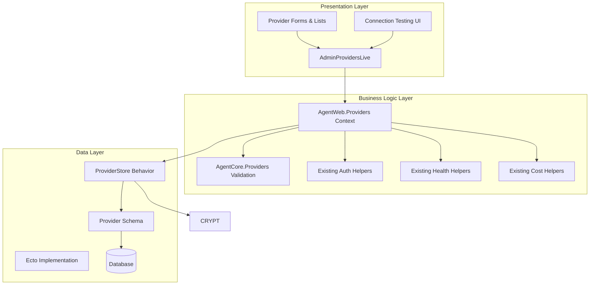

# Design Document

## Overview

The Provider Management UI system provides a comprehensive administrative interface for managing existing AI service provider configurations. The system builds upon the existing `AgentCore.Providers` domain model and leverages the established `AgentCore.Stores.ProviderStore` behavior to provide a web-based management interface.

The design follows the existing layered architecture with clear separation between presentation (LiveView), business logic (Context Module), and data persistence (existing Store Layer), while utilizing the comprehensive provider domain model already in place.

## Architecture

The system follows a three-layer architecture pattern:



### Layer Responsibilities

- **Presentation Layer**: Handles user interactions, form rendering, connection testing, and real-time updates
- **Business Logic Layer**: Manages provider operations, validation, authentication, health monitoring, and cost calculations
- **Data Layer**: Provides persistence, credential encryption, and data conversion between domain objects and database schemas

## Components and Interfaces

### 1. AdminProvidersLive (LiveView)

The main LiveView component that orchestrates the user interface and handles all user interactions.

**Key Responsibilities:**
- Render provider lists, forms, detail views, and connection test results
- Handle user events (create, edit, delete, test connection, filter, search)
- Manage view state transitions (list ↔ detail ↔ edit ↔ create ↔ test)
- Coordinate with the context module for data operations and connection testing

**State Management:**
```elixir
%{
  view_mode: :list | :detail | :edit | :create | :test,
  selected_provider: map() | nil,
  all_providers: [map()],
  filtered_providers: [map()],
  search_query: String.t(),
  type_filter: String.t(),
  status_filter: String.t(),
  provider_stats: map(),
  available_types: [map()],
  connection_test_result: map() | nil,
  health_metrics: map()
}
```

### 2. AgentWeb.Providers Context Module

The business logic layer that provides a stable API for provider operations using existing domain models.

**Core Functions:**
```elixir
@spec create_provider(map()) :: {:ok, AgentCore.Providers.t()} | {:error, String.t()}
@spec update_provider(String.t(), map()) :: {:ok, AgentCore.Providers.t()} | {:error, String.t()}
@spec list_providers_ui(map()) :: {:ok, [map()]} | {:error, String.t()}
@spec test_connection(String.t()) :: {:ok, map()} | {:error, String.t()}
@spec calculate_provider_stats([map()]) :: map()
@spec available_provider_types() :: [map()]
@spec get_health_status(String.t()) :: map()
```

**Integration with Existing Domain:**
- Uses `AgentCore.Providers.new/1` for provider creation
- Uses `AgentCore.Providers.update/2` for provider updates
- Uses `AgentCore.Providers.validate/1` for validation
- Uses existing helper functions like `AgentCore.Providers.enabled?/1`, `AgentCore.Providers.healthy?/1`
- Leverages `AgentCore.Stores.ProviderStore` behavior for persistence

### 3. Existing ProviderStore

The data persistence layer uses the existing `AgentCore.Stores.ProviderStore` behavior.

**Interface (Already Defined):**
```elixir
@spec create(AgentCore.Providers.t()) :: {:ok, provider_id()} | {:error, error()}
@spec get(provider_id()) :: {:ok, AgentCore.Providers.t()} | {:error, :not_found} | {:error, error()}
@spec update(provider_id(), map()) :: {:ok, AgentCore.Providers.t()} | {:error, :not_found} | {:error, error()}
@spec delete(provider_id()) :: :ok | {:error, :not_found} | {:error, error()}
@spec list(keyword()) :: {:ok, [AgentCore.Providers.t()]} | {:error, error()}
@spec health_check(provider_id()) :: {:ok, :healthy | :unhealthy} | {:error, :unreachable | :not_found | error()}
```

## Data Models

### AgentCore.Providers Domain Struct (Existing)

The system uses the existing comprehensive provider domain struct:

```elixir
%AgentCore.Providers{
  id: String.t() | integer() | nil,
  name: String.t(),
  enabled: boolean(),
  type: :cloud | :local | :enterprise | :custom,
  description: String.t() | nil,
  # Endpoint configuration
  base_url: String.t() | nil,
  api_version: String.t() | nil,
  request_timeout_ms: integer() | nil,
  connection_timeout_ms: integer() | nil,
  read_timeout_ms: integer() | nil,
  retries: integer() | nil,
  retry_backoff_ms: integer() | nil,
  default_headers: map() | nil,
  custom_params: map() | nil,
  # Authentication
  auth_type: :api_key | :oauth2 | :custom_header | :none | nil,
  api_key: String.t() | nil,
  oauth2_config: map() | nil,
  custom_auth_headers: map() | nil,
  token_refresh_url: String.t() | nil,
  credentials_encrypted: boolean() | nil,
  # Rate limiting
  requests_per_minute: integer() | nil,
  requests_per_hour: integer() | nil,
  concurrent_connections: integer() | nil,
  daily_quota: integer() | nil,
  monthly_quota: integer() | nil,
  burst_limit: integer() | nil,
  # Cost configuration
  input_token_cost_per_1k: float() | nil,
  output_token_cost_per_1k: float() | nil,
  request_cost: float() | nil,
  monthly_subscription: float() | nil,
  currency: String.t() | nil,
  billing_model: :token_based | :request_based | :subscription | nil,
  # Health status
  health_status: :online | :offline | :degraded | :unknown | nil,
  last_check_at: DateTime.t() | NaiveDateTime.t() | nil,
  response_time_ms: integer() | nil,
  error_rate: float() | nil,
  uptime_percentage: float() | nil,
  last_error: String.t() | nil,
  consecutive_failures: integer() | nil,
  # Metadata
  tags: [atom()] | nil,
  supported_models: [String.t()] | nil,
  inserted_at: DateTime.t() | NaiveDateTime.t() | nil,
  updated_at: DateTime.t() | NaiveDateTime.t() | nil
}
```

### UI Provider Format

The context module converts domain structs to UI-friendly maps:

```elixir
%{
  id: String.t(),
  name: String.t(),
  provider_type: String.t(),
  status: "online" | "offline" | "degraded" | "unknown",
  enabled: boolean(),
  base_url: String.t(),
  auth_type: String.t(),
  has_credentials: boolean(),
  response_time: integer(),
  error_rate: float(),
  uptime: float(),
  tags: [atom()],
  created_at: String.t(),
  updated_at: String.t(),
  cost_summary: map(),
  rate_limit_summary: map(),
  last_test_result: map() | nil
}
```

## Correctness Properties

*A property is a characteristic or behavior that should hold true across all valid executions of a system-essentially, a formal statement about what the system should do. Properties serve as the bridge between human-readable specifications and machine-verifiable correctness guarantees.*

Now I'll analyze the acceptance criteria to determine which ones are testable as properties using the prework tool.

### Converting EARS to Properties

Based on the prework analysis, I'll convert the testable acceptance criteria into universally quantified properties:

**Property 1: Provider Creation and Persistence**
*For any* valid provider data submitted through the form, the system should create a proper ServiceProvider struct and successfully persist it to the database
**Validates: Requirements 1.3, 12.4**

**Property 2: Provider Form Pre-population**
*For any* existing provider selected for editing, the form should be pre-populated with all current values from that provider
**Validates: Requirements 1.4**

**Property 3: Provider Validation**
*For any* provider submission with missing required fields or invalid data types, the system should reject the submission and display appropriate validation errors
**Validates: Requirements 1.5, 9.1, 9.2, 9.4**

**Property 4: Authentication Security**
*For any* provider with authentication credentials, the system should encrypt sensitive fields before storage, mask them in the UI, and never expose them in logs or exports
**Validates: Requirements 2.1, 2.4, 2.5, 13.1, 13.2, 13.4, 13.5**

**Property 5: Authentication Support**
*For any* provider configured with API key, OAuth2, or custom header authentication, the system should properly handle the authentication type and store credentials securely
**Validates: Requirements 2.1, 2.2, 2.3, 12.3**

**Property 6: Health Monitoring**
*For any* provider, the system should track and display real-time status, response times, error rates, and log status changes with timestamps
**Validates: Requirements 5.1, 5.2, 5.3, 5.5**

**Property 7: Connection Testing**
*For any* provider configuration, the connection test should attempt to connect using the configured parameters and display appropriate success or failure messages with details
**Validates: Requirements 10.1, 10.2, 10.3, 10.4, 10.5**

**Property 8: Provider Type Handling**
*For any* provider type selection, the system should show type-specific configuration options, validate type-specific required fields, and group providers by type in listings
**Validates: Requirements 7.2, 7.3, 7.5**

**Property 9: Provider Filtering and Search**
*For any* set of providers and filter criteria (type, status) or search terms, the system should return only providers that match all specified conditions
**Validates: Requirements 7.4, 11.2, 11.3, 11.4**

**Property 10: Provider Statistics Calculation**
*For any* collection of providers, the system should calculate accurate statistics including total count, counts by type, counts by status, and health metrics
**Validates: Requirements 11.5**

**Property 11: Form Data Conversion**
*For any* form submission, the system should correctly convert string inputs to appropriate data types (provider types to atoms, numeric strings to integers/floats, URLs to validated format)
**Validates: Requirements 12.1**

**Property 12: JSON Field Processing**
*For any* JSON input in configuration fields, the system should parse valid JSON correctly and provide appropriate defaults or error messages for invalid JSON
**Validates: Requirements 12.2**

**Property 13: Credential Update Logic**
*For any* provider credential update, the system should only update credentials when new values are provided and maintain existing credentials when fields are empty
**Validates: Requirements 13.3**

**Property 14: Provider List Display**
*For any* provider, the list view should display all key information including name, type, status, health metrics, and other essential details
**Validates: Requirements 11.1**

**Property 15: Health Check Functionality**
*For any* provider, the system should provide automated health check endpoints that properly test provider availability and functionality
**Validates: Requirements 5.4**

## Error Handling

The system implements comprehensive error handling at multiple levels:

### Form Validation Errors
- **Required Field Validation**: Clear messages for missing name, base URL, or provider type
- **URL Validation**: Proper URL format validation with helpful error messages
- **Range Validation**: Rate limit fields validated against acceptable ranges
- **Type Validation**: Provider type validation against supported types

### Authentication Errors
- **Credential Validation**: Connection testing with invalid credentials shows specific error messages
- **Encryption Errors**: Graceful handling of encryption/decryption failures
- **Token Management**: OAuth2 token refresh error handling

### Connection Testing Errors
- **Network Errors**: Timeout and connection failure handling with troubleshooting hints
- **API Errors**: Invalid API response handling with detailed error information
- **Authentication Errors**: Credential verification failures with security-conscious error messages

### Data Conversion Errors
- **Type Conversion**: Graceful handling of invalid numeric inputs with fallback to defaults
- **JSON Parsing**: Invalid JSON handled with error messages and default empty objects
- **URL Processing**: Malformed URLs cleaned and validated safely

### Persistence Errors
- **Database Constraints**: Unique name validation and foreign key constraints
- **Changeset Errors**: Detailed error messages from Ecto changesets
- **Connection Errors**: Graceful handling of database connectivity issues

### UI Error Display
- **Flash Messages**: Success and error messages displayed prominently
- **Inline Validation**: Real-time validation feedback on form fields
- **Error Recovery**: Users can correct errors without losing form data
- **Connection Test Results**: Detailed test results with actionable troubleshooting information

## Testing Strategy

The testing strategy employs a dual approach combining unit tests for specific scenarios and property-based tests for comprehensive coverage.

### Property-Based Testing

**Framework**: StreamData (Elixir's property-based testing library)
**Configuration**: Minimum 100 iterations per property test
**Test Organization**: Each correctness property implemented as a separate property test

**Property Test Examples**:

```elixir
# Property 1: Provider Creation and Persistence
property "provider creation and persistence" do
  check all provider_data <- valid_provider_generator() do
    attrs = convert_form_params_to_attrs(provider_data)
    
    assert {:ok, provider} = AgentWeb.ServiceProvider.create_provider(attrs)
    assert provider.name == attrs.name
    assert provider.provider_type == String.to_existing_atom(attrs.provider_type)
    
    # Verify persistence
    assert {:ok, retrieved} = AgentInfra.StoreEcto.ServiceProviderStore.get(provider.id)
    assert retrieved.name == provider.name
  end
end

# Property 4: Authentication Security
property "authentication security" do
  check all {auth_type, credentials} <- authentication_generator() do
    attrs = %{
      name: "Test Provider",
      provider_type: "cloud",
      authentication: %{
        auth_type: auth_type,
        api_key: credentials[:api_key],
        oauth2_config: credentials[:oauth2_config]
      }
    }
    
    {:ok, provider} = AgentWeb.ServiceProvider.create_provider(attrs)
    
    # Verify encryption
    if provider.authentication.api_key do
      assert provider.authentication.credentials_encrypted == true
      # Verify the stored value is encrypted (not plaintext)
      refute provider.authentication.api_key == credentials[:api_key]
    end
    
    # Verify UI masking
    ui_format = AgentWeb.ServiceProvider.convert_to_ui_format(provider)
    if ui_format.auth_config[:api_key] do
      assert String.contains?(ui_format.auth_config[:api_key], "*")
    end
  end
end

# Property 7: Connection Testing
property "connection testing" do
  check all provider_config <- provider_config_generator() do
    {:ok, provider} = AgentWeb.ServiceProvider.create_provider(provider_config)
    
    result = AgentWeb.ServiceProvider.test_connection(provider.id)
    
    # Should always return a result (success or failure)
    assert match?({:ok, %{status: _}}, result) or match?({:error, _}, result)
    
    case result do
      {:ok, %{status: :success, response_time: time}} ->
        assert is_integer(time) and time >= 0
      {:error, error_msg} ->
        assert is_binary(error_msg) and String.length(error_msg) > 0
    end
  end
end
```

**Test Generators**:
```elixir
def valid_provider_generator do
  gen all name <- string(:alphanumeric, min_length: 1, max_length: 50),
          provider_type <- member_of(["cloud", "local", "enterprise", "custom"]),
          base_url <- url_generator(),
          timeout <- integer(1000..30000) do
    %{
      "name" => name,
      "provider_type" => provider_type,
      "endpoint_config" => %{
        "base_url" => base_url,
        "timeout_ms" => Integer.to_string(timeout)
      }
    }
  end
end

def authentication_generator do
  gen all auth_type <- member_of(["api_key", "oauth2", "custom_header"]),
          api_key <- string(:alphanumeric, min_length: 10, max_length: 100),
          oauth_config <- map_of(string(:alphanumeric), string(:alphanumeric)) do
    {auth_type, %{api_key: api_key, oauth2_config: oauth_config}}
  end
end
```

### Unit Testing

**Focus Areas**:
- **Form Rendering**: Verify all required form fields are present for each provider type
- **Event Handling**: Test specific user interactions (create, edit, delete, test connection)
- **Edge Cases**: Empty states, invalid inputs, boundary conditions, network failures
- **Integration Points**: LiveView ↔ Context ↔ Store interactions
- **Security**: Credential masking, encryption, secure logging

**Unit Test Examples**:
```elixir
test "create provider form displays all required fields" do
  {:ok, view, _html} = live(conn, "/admin/providers")
  
  view |> element("button", "New Provider") |> render_click()
  
  assert has_element?(view, "input[name='provider[name]']")
  assert has_element?(view, "select[name='provider[provider_type]']")
  assert has_element?(view, "input[name='provider[endpoint_config][base_url]']")
  assert has_element?(view, "select[name='provider[authentication][auth_type]']")
  assert has_element?(view, "input[name='provider[rate_limits][requests_per_minute]']")
end

test "connection test displays results" do
  provider = create_provider(%{name: "Test Provider", base_url: "https://api.example.com"})
  
  {:ok, view, _html} = live(conn, "/admin/providers/#{provider.id}")
  
  view |> element("button", "Test Connection") |> render_click()
  
  # Should show test results
  assert has_element?(view, "[data-testid='connection-test-result']")
end

test "provider filtering by type" do
  cloud_provider = create_provider(%{provider_type: "cloud", name: "Cloud Provider"})
  local_provider = create_provider(%{provider_type: "local", name: "Local Provider"})
  
  {:ok, view, _html} = live(conn, "/admin/providers")
  
  view |> form("select", %{"type_filter" => "cloud"}) |> render_change()
  
  assert has_element?(view, "td", "Cloud Provider")
  refute has_element?(view, "td", "Local Provider")
end
```

**Test Configuration**:
- **Property Tests**: Tagged with `Feature: service-provider-management, Property N: [property_text]`
- **Unit Tests**: Organized by component (LiveView, Context, Store, Security)
- **Integration Tests**: End-to-end workflows (create → configure → test → edit → delete)
- **Security Tests**: Credential handling, encryption, masking, logging safety
- **Performance Tests**: Large dataset handling, concurrent connections, health monitoring

### Test Data Management

**Factories**: Use ExMachina for consistent test data generation
**Database**: Separate test database with proper cleanup between tests
**Mocking**: Minimal mocking for external API calls, prefer real implementations for internal logic
**Fixtures**: Reusable provider configurations for common test scenarios
**Security**: Test data with various credential types and sensitive information patterns