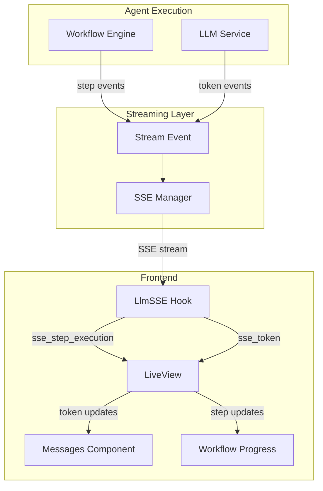

# Design Document: Stream Event Separation

## Overview

This design implements a clean separation between workflow step execution events and LLM response token events in the streaming system. Currently, both types of events are mixed together in the message content, creating a confusing user experience where workflow progress messages appear alongside the actual LLM response.

The solution introduces a new `step_execution` event type while maintaining backward compatibility with existing `token` events. This allows the UI to display workflow progress in a dedicated area separate from the clean LLM response content.

## Architecture



## Components and Interfaces

### StreamEvent Module Enhancement

**Location:** `apps/agent_runtime/lib/agent_runtime/llm/stream_event.ex`

**New Event Type:**
```elixir
@type event_type :: :open | :token | :done | :clarify | :error | :ping | :step_execution

def step_execution(step_name, status, opts \\ []) do
  data = %{
    "step_name" => step_name,
    "status" => status,
    "timestamp" => System.system_time(:millisecond)
  }
  
  data = 
    data
    |> maybe_put("execution_time_ms", opts[:execution_time_ms])
    |> maybe_put("error", opts[:error])
    |> maybe_put("step_id", opts[:step_id])
    
  new(:step_execution, data)
end
```

**Status Values:**
- `"starting"` - Step has begun execution
- `"completed"` - Step finished successfully  
- `"failed"` - Step encountered an error
- `"skipped"` - Step was skipped due to conditions

### SSE Manager Updates

**Location:** `apps/agent_web/lib/agent_web/streaming/sse_manager.ex`

**New Message Handler:**
```elixir
# Step execution events
{:sse_step_execution, step_name, status, opts} ->
  event = StreamEvent.step_execution(step_name, status, opts)
  case send_event(conn, event) do
    {:ok, conn} -> do_event_loop(conn, task_ref, timeout)
    {:error, _reason} -> conn
  end
```

**Integration Points:**
- Workflow engine sends `{:sse_step_execution, step_name, status, opts}` messages
- LLM service continues sending `{:sse_token, token}` messages unchanged
- Both event types flow through the same SSE connection but are handled separately

### JavaScript Hook Enhancement

**Location:** `apps/agent_web/assets/js/app.js`

**Enhanced LlmSSE Hook:**
```javascript
Hooks.LlmSSE = {
  mounted() {
    // ... existing setup code ...
  },
  
  handleSSEEvent(event, data) {
    switch(event) {
      case 'step_execution':
        this.pushEvent('sse_step_execution', {
          step_name: data.step_name,
          status: data.status,
          timestamp: data.timestamp,
          execution_time_ms: data.execution_time_ms,
          error: data.error,
          step_id: data.step_id
        });
        break;
        
      case 'token':
        // Existing token handling - unchanged
        this.pushEvent('sse_token', { token: data.token });
        break;
        
      // ... other existing cases unchanged ...
    }
  }
}
```

### LiveView Event Handlers

**Location:** `apps/agent_web/lib/agent_web_web/live/agent_testing_live.ex`

**New Event Handler:**
```elixir
@impl true
def handle_event("sse_step_execution", payload, socket) do
  step_name = Map.get(payload, "step_name")
  status = Map.get(payload, "status")
  step_id = Map.get(payload, "step_id")
  execution_time_ms = Map.get(payload, "execution_time_ms")
  error = Map.get(payload, "error")
  
  socket = 
    socket
    |> update_workflow_progress(step_name, status, step_id, execution_time_ms, error)
    |> maybe_update_execution_status(status, step_name)
  
  {:noreply, socket}
end

# Existing sse_token handler remains unchanged - only updates message content
@impl true  
def handle_event("sse_token", %{"token" => token}, socket) do
  buf = (socket.assigns.stream_buffer || "") <> (token || "")
  {:noreply, assign(socket, :stream_buffer, buf)}
end
```

### Messages Component Updates

**Location:** `apps/agent_web/lib/agent_web_web/components/messages.ex`

**Key Changes:**
- Remove workflow progress indicators from message content area
- Focus exclusively on displaying clean LLM response content
- Maintain existing streaming display for response tokens only

**Updated Template:**
```heex
<!-- Remove workflow progress from streaming section -->
<%= if @streaming do %>
  <div class="px-6 py-8 bg-primary/5 border-l-4 border-primary">
    <div class="max-w-4xl mx-auto">
      <div class="flex items-center gap-3 mb-4">
        <div class="w-8 h-8 rounded bg-primary flex items-center justify-center text-primary-content">
          <.assistant_icon class="w-4 h-4" />
        </div>
        <span class="text-sm font-bold text-primary italic animate-pulse">
          Assistant is responding...
        </span>
      </div>

      <div class="pl-11">
        <!-- Only display response content, no workflow steps -->
        <div class="prose prose-sm max-w-none dark:prose-invert">
          {raw(render_markdown(@stream_buffer))}
        </div>
        <div class="flex space-x-1.5 mt-4">
          <div class="w-1.5 h-1.5 bg-primary/40 rounded-full animate-bounce"></div>
          <div class="w-1.5 h-1.5 bg-primary/40 rounded-full animate-bounce [animation-delay:0.2s]"></div>
          <div class="w-1.5 h-1.5 bg-primary/40 rounded-full animate-bounce [animation-delay:0.4s]"></div>
        </div>
      </div>
    </div>
  </div>
<% end %>
```

## Data Models

### Step Execution Event Data

```elixir
%{
  "step_name" => "Generate Query",           # Human-readable step name
  "status" => "starting" | "completed" | "failed" | "skipped",
  "timestamp" => 1704398400000,             # Unix timestamp in milliseconds
  "execution_time_ms" => 1250,             # Optional: time taken for step
  "error" => "Error message",              # Optional: error details if failed
  "step_id" => "step_1",                   # Optional: unique step identifier
}
```

### Workflow Progress State

```elixir
%{
  current_step: "Generate Query",
  status: :running | :completed | :failed | :idle,
  steps: [
    %{
      name: "Generate Query", 
      status: :completed, 
      execution_time_ms: 1250,
      timestamp: 1704398400000
    },
    %{
      name: "Execute Search", 
      status: :running, 
      timestamp: 1704398401250
    },
    # ... more steps
  ],
  total_steps: 5,
  completed_steps: 1,
  started_at: ~U[2024-01-04 22:00:00Z],
  completed_at: nil
}
```

## Error Handling

### Step Execution Errors

When a workflow step fails:

1. **Event Generation:** `StreamEvent.step_execution(step_name, "failed", error: error_message)`
2. **UI Update:** Workflow progress indicator shows failed step with error details
3. **Message Content:** Remains clean - no error text mixed into LLM response
4. **Recovery:** User can retry or continue based on error type

### Backward Compatibility

- Existing `token`, `done`, `error`, `clarify` events unchanged
- Legacy clients continue to work without modification
- New `step_execution` events are additive - ignored by older clients
- SSE Manager maintains all existing event handling patterns

## Testing Strategy

### Unit Tests

**StreamEvent Tests:**
- Test `step_execution/3` constructor with various status values
- Verify data structure and optional fields handling
- Test backward compatibility with existing event types

**SSE Manager Tests:**
- Test new `{:sse_step_execution, ...}` message handling
- Verify existing event handling remains unchanged
- Test event serialization and SSE formatting

**LiveView Tests:**
- Test `sse_step_execution` event handler
- Verify workflow progress updates
- Test separation from message content updates
- Test existing `sse_token` handler unchanged

### Integration Tests

**End-to-End Streaming:**
- Test complete workflow with mixed step_execution and token events
- Verify UI displays workflow progress separately from message content
- Test error scenarios and recovery flows

**JavaScript Hook Tests:**
- Test event routing for new `step_execution` events
- Verify existing event handling unchanged
- Test browser compatibility and error handling

## Implementation Notes

### Migration Strategy

1. **Phase 1:** Add new event type and SSE handling (backward compatible)
2. **Phase 2:** Update workflow engine to send step_execution events
3. **Phase 3:** Update UI components to handle separated events
4. **Phase 4:** Clean up any remaining mixed event handling

### Performance Considerations

- **Event Volume:** Step execution events are low-frequency (typically 3-10 per request)
- **Token Events:** High-frequency streaming continues unchanged
- **Memory Usage:** Minimal additional state for workflow progress tracking
- **Network Overhead:** Negligible increase in SSE payload size

### Security Considerations

- Step execution events contain no sensitive data
- Existing SSE security patterns maintained
- No additional authentication or authorization required
- Error messages in step events should not leak sensitive information

## Correctness Properties

*A property is a characteristic or behavior that should hold true across all valid executions of a system-essentially, a formal statement about what the system should do. Properties serve as the bridge between human-readable specifications and machine-verifiable correctness guarantees.*

### Property 1: Step Execution Event Structure
*For any* step execution event created by the system, it should contain step_name, status, and timestamp fields, and when the status is "completed" it should include execution_time_ms, and when the status is "failed" it should include error details
**Validates: Requirements 2.1, 2.2, 2.3**

### Property 2: Event Type Separation
*For any* stream event generated by the system, step execution events should only contain workflow data and token events should only contain LLM response content, with no mixing of data types between event categories
**Validates: Requirements 1.1, 1.2, 2.4, 3.1, 3.3**

### Property 3: SSE Manager Event Routing
*For any* workflow step state change (starting, completed, failed), the SSE Manager should send the appropriate step_execution event with correct status, and for any LLM token generation, it should send clean token events containing only response content
**Validates: Requirements 1.3, 1.4, 1.5**

### Property 4: UI Component Event Separation
*For any* step_execution event received by the UI, it should update only the workflow progress indicator and not the message content, and for any token event received, it should update only the message content and not the progress indicator
**Validates: Requirements 2.5, 3.2, 5.2, 5.3**

### Property 5: Message Content Cleanliness
*For any* final assistant message displayed to the user, it should contain only clean LLM response text without any workflow status messages, step execution details, or progress indicators
**Validates: Requirements 3.4, 5.5**

### Property 6: Backward Compatibility Preservation
*For any* existing event type (token, done, error, clarify), the event structure and handling should remain unchanged when the new step_execution event type is added to the system
**Validates: Requirements 4.1, 4.3, 4.4, 4.5**

### Property 7: JavaScript Hook Event Routing
*For any* SSE event received by the LlmSSE hook, step_execution events should trigger sse_step_execution Phoenix events and token events should trigger sse_token Phoenix events, with proper routing to workflow progress vs message content updates
**Validates: Requirements 6.1, 6.2, 6.3, 6.5**

### Property 8: Progress Indicator Content
*For any* workflow progress indicator displayed in the UI, it should show current step name, status, and completion percentage based on step_execution events, and should remain separate from the message content area
**Validates: Requirements 5.1, 5.4**