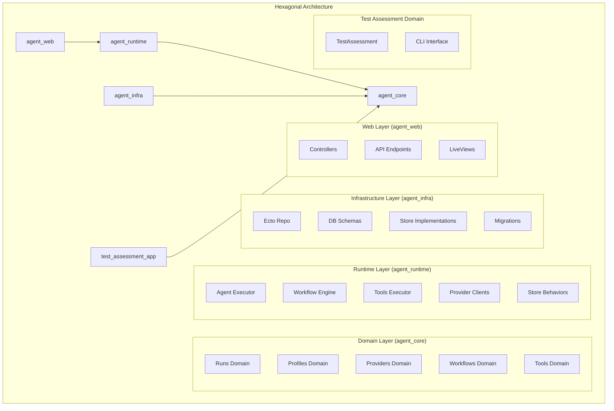

# Umbrella Restructure Design Document

## Overview

The Umbrella Restructure project reorganizes the current Phoenix umbrella application to separate workflow-related implementation and test-assessment functionality into dedicated umbrella apps. This restructuring creates a more modular, maintainable, and expandable architecture where the agent can include workflows from multiple specialized apps.

The restructure maintains complete backward compatibility while establishing clear boundaries between different functional domains. The new architecture enables independent development, testing, and deployment of workflow and test-assessment functionality while preserving the existing API contracts and system behavior.

## Architecture

The restructured system follows a clean separation of concerns with three main umbrella apps:

### Current Structure
```
apps/
├── agent_core/          # Core functionality + WorkflowEngine + TestAssessment
├── agent_runtime/       # Runtime functionality + WorkflowEngine integration
└── agent_web/           # Web interface
```

### Target Structure
```
apps/
├── agent_core/          # Domain models, contracts, and behaviors (no Ecto, no Repo)
├── agent_runtime/       # Execution engines and orchestration (behavior implementations)
├── agent_infra/         # Infrastructure layer (Ecto, DB, persistence)
├── agent_web/           # Web interface (Phoenix controllers/API)
└── test_assessment_app/ # Test assessment functionality (separate domain)
```

### Architectural Principles

1. **Domain-Driven Design**: Core domain logic separated from infrastructure concerns
2. **Ports and Adapters**: Clear interfaces between layers with dependency inversion
3. **Single Responsibility**: Each layer has a distinct, well-defined purpose
4. **Infrastructure Independence**: Domain and runtime layers don't depend on specific infrastructure
5. **Clean Dependencies**: Dependencies flow inward (web → runtime → core, infra → core)



## Components and Interfaces

### Agent Core (agent_core)

**Purpose**: Domain models, contracts, and behaviors only - no infrastructure dependencies

**Rule**: No Ecto, no Repo, no migrations, no HTTP clients

**Domain Modules**:

```elixir
# Runs Domain - structs, state machine, events schema
defmodule AgentCore.Runs do
  defstruct [:id, :status, :profile_id, :created_at, :updated_at]
  
  @type status :: :pending | :running | :completed | :failed
  @type t :: %__MODULE__{...}
end

defmodule AgentCore.Runs.StateMachine do
  @spec transition(AgentCore.Runs.t(), atom()) :: {:ok, AgentCore.Runs.t()} | {:error, term()}
end

# Profiles Domain - LLMProfile struct, validation, resolved configs
defmodule AgentCore.Profiles.LLMProfile do
  defstruct [:id, :name, :model, :temperature, :max_tokens]
  
  @spec validate(map()) :: {:ok, t()} | {:error, Ecto.Changeset.t()}
  def validate(attrs)
  
  @spec resolve_config(t()) :: map()
  def resolve_config(profile)
end

# Providers Domain - behaviors/ports + request/response structs
defmodule AgentCore.Providers.Behavior do
  @callback execute(request :: map()) :: {:ok, map()} | {:error, term()}
  @callback health_check() :: :ok | {:error, term()}
end

defmodule AgentCore.Providers.Request do
  defstruct [:provider_id, :method, :payload, :options]
end

# Workflows Domain - WorkflowSpec, predicates, runtime context schema, engine behavior
defmodule AgentCore.Workflows.Spec do
  defstruct [:id, :version, :entry, :nodes, :edges, :exits]
end

defmodule AgentCore.Workflows.Engine do
  @callback execute(spec :: AgentCore.Workflows.Spec.t(), input :: map()) :: 
    {:ok, map()} | {:error, term()}
end

# Tools Domain - Tool behavior + schemas
defmodule AgentCore.Tools.Behavior do
  @callback execute(input :: map()) :: {:ok, map()} | {:error, term()}
  @callback schema() :: map()
end
```

**Store Ports (Behaviors)**:
```elixir
defmodule AgentCore.Stores.RunStore do
  @callback create(AgentCore.Runs.t()) :: {:ok, AgentCore.Runs.t()} | {:error, term()}
  @callback get(String.t()) :: {:ok, AgentCore.Runs.t()} | {:error, :not_found}
  @callback update(String.t(), map()) :: {:ok, AgentCore.Runs.t()} | {:error, term()}
end

defmodule AgentCore.Stores.ProfileStore do
  @callback create(AgentCore.Profiles.LLMProfile.t()) :: {:ok, AgentCore.Profiles.LLMProfile.t()} | {:error, term()}
  @callback get(String.t()) :: {:ok, AgentCore.Profiles.LLMProfile.t()} | {:error, :not_found}
end
```

### Agent Runtime (agent_runtime)

**Purpose**: Execution engines and orchestration - implements behaviors from agent_core

**Rule**: Runtime sees only behaviors/interfaces of stores, not Ecto schemas

**Key Modules**:

```elixir
# Main orchestrator
defmodule AgentRuntime.Agent do
  @spec execute_request(map()) :: {:ok, map()} | {:error, term()}
  def execute_request(request) do
    # Orchestrates request → workflows/tools/providers
  end
end

# Workflow engine implementation
defmodule AgentRuntime.Workflows.Engine do
  @behaviour AgentCore.Workflows.Engine
  
  @impl true
  def execute(spec, input) do
    # Graph engine implementation
  end
end

# Tools execution
defmodule AgentRuntime.Tools.Executor do
  @spec execute_tool(String.t(), map()) :: {:ok, map()} | {:error, term()}
end

defmodule AgentRuntime.Tools.Registry do
  @spec register_tool(module()) :: :ok
  @spec get_tool(String.t()) :: {:ok, module()} | {:error, :not_found}
end

# Provider implementations
defmodule AgentRuntime.Providers.HTTPClient do
  @behaviour AgentCore.Providers.Behavior
  
  @impl true
  def execute(request) do
    # HTTP client implementation
  end
end

# Store behavior wrappers
defmodule AgentRuntime.Stores.RunStoreWrapper do
  @behaviour AgentCore.Stores.RunStore
  
  def create(run) do
    # Delegates to configured store implementation
    store_impl().create(run)
  end
  
  defp store_impl, do: Application.get_env(:agent_runtime, :run_store)
end
```

### Agent Infrastructure (agent_infra)

**Purpose**: Everything Ecto/DB related - the only app with database dependencies

**Rule**: This app is the only one with Ecto

**Key Modules**:

```elixir
# Ecto Repo
defmodule AgentInfra.Repo do
  use Ecto.Repo,
    otp_app: :agent_infra,
    adapter: Ecto.Adapters.Postgres
end

# Database schemas
defmodule AgentInfra.Schema.Run do
  use Ecto.Schema
  
  schema "runs" do
    field :status, :string
    field :profile_id, :string
    # ... other fields
    timestamps()
  end
end

# Store implementations that implement the ports/behaviors
defmodule AgentInfra.StoreEcto.RunStore do
  @behaviour AgentCore.Stores.RunStore
  
  @impl true
  def create(run) do
    %AgentInfra.Schema.Run{}
    |> AgentInfra.Schema.Run.changeset(Map.from_struct(run))
    |> AgentInfra.Repo.insert()
    |> case do
      {:ok, schema} -> {:ok, to_domain_struct(schema)}
      error -> error
    end
  end
  
  defp to_domain_struct(schema) do
    struct(AgentCore.Runs, Map.from_struct(schema))
  end
end
```

### Agent Web (agent_web)

**Purpose**: Phoenix controllers/API - calls AgentRuntime public API

**Rule**: Does not touch Repo directly, only calls AgentRuntime

**Key Modules**:

```elixir
defmodule AgentWeb.RunController do
  use AgentWeb, :controller
  
  def create(conn, params) do
    case AgentRuntime.Agent.execute_request(params) do
      {:ok, result} -> json(conn, result)
      {:error, reason} -> put_status(conn, 422) |> json(%{error: reason})
    end
  end
end
```

### Test Assessment App (test_assessment_app)

**Purpose**: Separate domain for test assessment functionality

**Modules**: All existing TestAssessment modules with TestAssessmentApp namespace

## Data Models

### App Configuration

```elixir
defmodule WorkflowApp.Config do
  @type t :: %__MODULE__{
    workflows: [atom()],
    default_workflow: atom() | nil,
    registry_opts: keyword(),
    llm_integration: map() | nil
  }
end

defmodule TestAssessmentApp.Config do
  @type t :: %__MODULE__{
    default_output_format: atom(),
    optimization_enabled: boolean(),
    backup_directory: String.t(),
    analysis_depth: :shallow | :deep
  }
end
```

### Migration Tracking

```elixir
defmodule UmbrellaRestructure.MigrationResult do
  @type t :: %__MODULE__{
    moved_modules: %{String.t() => String.t()},
    updated_dependencies: [String.t()],
    created_apps: [String.t()],
    test_results: %{String.t() => boolean()},
    migration_timestamp: DateTime.t()
  }
end
```

## Correctness Properties

*A property is a characteristic or behavior that should hold true across all valid executions of a system-essentially, a formal statement about what the system should do. Properties serve as the bridge between human-readable specifications and machine-verifiable correctness guarantees.*

### Property Reflection

After reviewing all identified properties, several can be consolidated to eliminate redundancy:

- Properties related to module location verification (1.1, 1.2, 1.3, 2.1, 2.2, 2.3) can be combined into comprehensive location verification properties
- Properties related to API compatibility (6.1, 6.2, 6.3) can be combined into a single backward compatibility property
- Properties related to test execution (8.1, 8.2, 8.3, 8.4) can be combined into comprehensive test compatibility property
- Properties related to namespacing (7.1, 7.2, 7.3) can be combined into a single namespacing property

### Core Correctness Properties

**Property 1: Module migration completeness**
*For any* module that should be migrated to a new app, it should exist in the target app directory and not exist in the original location after migration
**Validates: Requirements 1.1, 1.2, 1.3, 2.1, 2.2, 2.3**

**Property 2: App configuration correctness**
*For any* newly created app, it should have a properly configured mix.exs file with correct dependencies and app configuration
**Validates: Requirements 1.4, 2.4**

**Property 3: Cross-app integration functionality**
*For any* integration point between apps, the calling app should be able to successfully invoke functions in the target app through well-defined interfaces
**Validates: Requirements 1.5, 2.5, 3.1, 3.2**

**Property 4: API boundary enforcement**
*For any* cross-app communication, only public APIs should be used and internal implementation details should not be accessible
**Validates: Requirements 3.2, 3.4, 3.5**

**Property 5: Dependency management correctness**
*For any* app in the umbrella, its mix.exs should declare only the minimum necessary dependencies and the build system should compile apps in correct dependency order
**Validates: Requirements 3.3, 4.1, 4.2, 4.5**

**Property 6: Test isolation and independence**
*For any* app's test suite, it should run independently without cross-contamination and pass without requiring changes after restructure
**Validates: Requirements 4.3, 8.1, 8.2, 8.3, 8.4**

**Property 7: Agent extensibility and workflow discovery**
*For any* workflow app added to the umbrella, the agent should be able to discover its workflows and route execution requests correctly
**Validates: Requirements 5.1, 5.2, 5.3, 5.4, 5.5**

**Property 8: Backward compatibility preservation**
*For any* existing API endpoint or workflow execution, the results should be identical to pre-restructure behavior
**Validates: Requirements 6.1, 6.2, 6.3, 6.5**

**Property 9: Proper module namespacing**
*For any* module moved to a new app, it should use the correct namespace prefix and cross-app references should use fully qualified module names
**Validates: Requirements 7.1, 7.2, 7.3, 7.5**

**Property 10: System operational equivalence**
*For any* system build or runtime execution, the restructured system should have the same structure, entry points, and performance characteristics as the original
**Validates: Requirements 9.1, 9.3**

**Property 11: Documentation completeness**
*For any* architectural change or integration pattern, there should be corresponding documentation that explains the new structure and provides examples
**Validates: Requirements 10.1, 10.3, 10.4, 10.5**

## Error Handling

The restructure process implements comprehensive error handling and rollback capabilities:

### Migration Errors
- **Module conflicts**: Detect and resolve naming conflicts during migration
- **Dependency cycles**: Identify and break circular dependencies between apps
- **Missing dependencies**: Ensure all required dependencies are properly declared

### Integration Errors
- **API compatibility**: Validate that all integration points maintain backward compatibility
- **Cross-app communication**: Handle failures in cross-app function calls gracefully
- **Registry synchronization**: Ensure workflow registries remain consistent across apps

### Rollback Strategy
- **Backup creation**: Create complete backups before starting migration
- **Incremental migration**: Migrate modules in small batches to enable partial rollback
- **Validation checkpoints**: Verify system functionality at each migration step
- **Automatic rollback**: Revert changes if critical tests fail during migration

## Testing Strategy

The Umbrella Restructure uses a comprehensive testing approach combining unit tests, integration tests, and property-based tests to ensure the migration maintains system correctness.

### Unit Testing Approach
Unit tests will verify specific migration scenarios:
- Module location verification after migration
- Mix.exs configuration correctness
- API interface compatibility
- Namespace conversion accuracy
- Dependency declaration validation

### Property-Based Testing Approach
Property-based tests will verify universal properties using **StreamData** for Elixir:
- Each property-based test will run a minimum of 100 iterations
- Tests will generate various app configurations and verify migration correctness
- Cross-app communication patterns will be tested with random inputs

**Property-based test tagging format**: `# Feature: umbrella-restructure, Property {number}: {property_text}`

### Integration Testing
- End-to-end workflow execution across restructured apps
- Cross-app communication verification
- Agent workflow discovery and routing
- Test assessment functionality through new app structure

### Migration Validation Testing
- Pre-migration system state capture
- Post-migration functionality verification
- Performance regression testing
- Backward compatibility validation

### Test Coverage Requirements
- 100% coverage for migration logic and rollback procedures
- Complete integration test coverage for cross-app communication
- Property-based tests for all correctness properties
- Performance benchmarks to detect regressions

## Implementation Phases

### Phase 1: Preparation and Analysis
- Analyze current module dependencies and identify domain boundaries
- Create detailed migration plan mapping current modules to new layered structure
- Set up new app directory structures for agent_core, agent_runtime, agent_infra, and test_assessment_app
- Create initial mix.exs files with proper dependency declarations

### Phase 2: Domain Layer Creation (agent_core)
- Extract all domain models, structs, and behaviors from current agent_core
- Create clean domain modules: Runs, Profiles, Providers, Workflows, Tools
- Define store ports/behaviors for infrastructure layer to implement
- Remove all Ecto, Repo, and infrastructure dependencies
- Update module namespaces to reflect domain organization

### Phase 3: Infrastructure Layer Creation (agent_infra)
- Move all Ecto schemas, migrations, and Repo to agent_infra
- Implement store behaviors defined in agent_core
- Create conversion functions between domain structs and database schemas
- Ensure agent_infra is the only app with database dependencies
- Test database operations through store implementations

### Phase 4: Runtime Layer Updates (agent_runtime)
- Update agent_runtime to implement behaviors from agent_core
- Create execution engines for workflows, tools, and providers
- Implement main Agent executor for request orchestration
- Update to use store behaviors instead of direct Ecto access
- Ensure runtime layer has no direct infrastructure dependencies

### Phase 5: Web Layer Updates (agent_web)
- Update agent_web to only call AgentRuntime APIs
- Remove any direct Repo or agent_infra dependencies
- Ensure all existing API endpoints continue to work identically
- Update controllers to delegate all business logic to agent_runtime
- Test web layer integration with new runtime APIs

### Phase 6: Test Assessment App Migration
- Move all TestAssessment modules to test_assessment_app
- Update module namespaces to TestAssessmentApp.*
- Migrate CLI and Mix tasks to new app
- Ensure test assessment follows same architectural principles
- Test CLI and assessment functionality

### Phase 7: Testing and Validation
- Run comprehensive test suite across all layers
- Validate clean dependency flow (web → runtime → core, infra → core)
- Performance testing and optimization
- Integration testing across all layers
- Backward compatibility validation

### Phase 8: Deployment and Documentation
- Deploy restructured system with proper configuration
- Update architecture documentation to reflect layered structure
- Create developer guides for maintaining clean architecture
- Monitor production functionality and performance
- Complete migration documentation with architectural principles