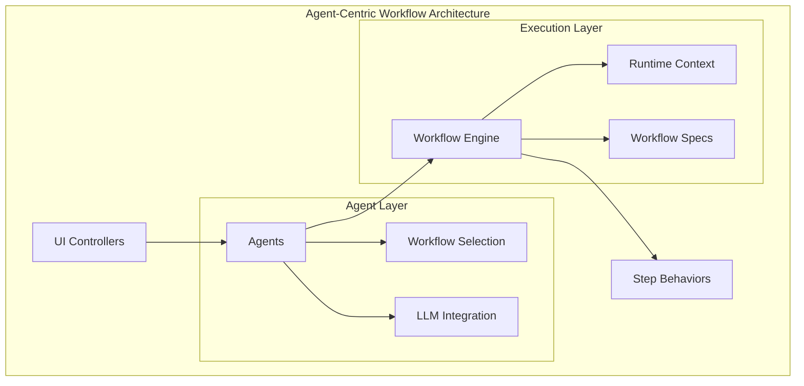

# Workflow Engine Design Document

## Overview

The Workflow Engine is a generic execution system that enables defining complex business logic as data structures rather than hardcoded implementations. It operates through an agent-based architecture where agents serve as the primary interface for workflow execution.

The system provides a single source of truth for workflow definitions through step behavior modules, workflow graph specifications, and a generic execution engine. Agents expose one or more workflows and serve as the integration point between UI controllers and LLM systems. The first implementation focuses on a comprehensive History RAG Augmentation workflow that enhances user interactions through intelligent context retrieval and prompt augmentation.

## Architecture

The Workflow Engine follows a four-layer agent-centric architecture:

### 1. Step Behavior Layer
Individual step modules that implement the `WorkflowEngine.Step` behavior. Each step encapsulates a single unit of work with well-defined inputs and outputs.

### 2. Workflow Specification Layer
Data structures that define workflow topology, routing logic, and execution flow. Workflows are defined as immutable specifications that can be validated, versioned, and stored.

### 3. Execution Engine Layer
The generic runtime that executes workflow specifications by traversing nodes, evaluating predicates, and managing execution context.

### 4. Agent Interface Layer
Agents that expose workflows to UI controllers and manage LLM integration. Each agent can host multiple workflows and provides a clean interface for external systems.



## Components and Interfaces

### WorkflowEngine.Step Behavior

```elixir
defmodule WorkflowEngine.Step do
  @callback id() :: atom() | String.t()
  @callback run(ctx :: map(), input :: map(), opts :: map()) :: 
    {:ok, ctx, output} | {:skip, ctx, output} | {:error, ctx, error}
end
```

**Key Principles:**
- All state changes flow through the immutable `ctx` parameter
- `output` is always structured data for observability
- `opts` provides per-node configuration without affecting flow logic
- Steps are pure functions with no side effects on global state

### WorkflowEngine.Spec Structure

```elixir
defstruct [
  :id,                    # atom() - unique workflow identifier
  :version,               # integer() - workflow version
  :entry,                 # atom() - entry node id
  :nodes,                 # %{node_id => %{step: module(), opts: map()}}
  :edges,                 # [%{from: atom(), to: atom(), when: predicate()}]
  :exits,                 # MapSet.t(atom()) - exit node ids
  :schema                 # %{input: schema, output: schema} - optional
]
```

### Edge Predicates

Four predicate types provide deterministic routing:

1. `{:always}` - Always matches
2. `{:decision, key, value}` - Matches when `ctx.decisions[key] == value`
3. `{:artifact_present, key}` - Matches when `ctx.artifacts[key]` is not nil
4. `{:custom, function}` - Custom predicate function `(ctx -> boolean)`

### Runtime Context Structure

```elixir
defstruct [
  :decisions,             # %{atom() => term()} - routing decisions
  :artifacts,             # %{atom() => term()} - step outputs and payloads
  :debug,                 # %{atom() => term()} - execution trace data
  :meta,                  # %{atom() => term()} - run metadata
  :events                 # [map()] - optional event stream
]
```

## Data Models

### Workflow Result

```elixir
defstruct [
  :status,                # :ok | :failed | :error
  :final_output,          # map() - normalized workflow output
  :visited_nodes,         # [atom()] - execution path
  :trace,                 # [map()] - detailed execution trace
  :error                  # term() - error details if status != :ok
]
```

### Node Trace Entry

```elixir
%{
  node_id: atom(),
  step_module: module(),
  status: :ok | :skip | :error,
  duration_ms: integer(),
  input_keys: [atom()],
  output_keys: [atom()],
  error: term() | nil
}
```

## Correctness Properties

*A property is a characteristic or behavior that should hold true across all valid executions of a system-essentially, a formal statement about what the system should do. Properties serve as the bridge between human-readable specifications and machine-verifiable correctness guarantees.*
### Property Reflection

After reviewing all identified properties, several can be consolidated to eliminate redundancy:

- Properties 1.1, 7.1, and 7.2 all relate to workflow validation and can be combined into a comprehensive validation property
- Properties 6.1, 6.2, 6.3 all relate to trace recording and can be combined into a single tracing property
- Properties 4.2, 4.3, 4.4, 4.5 all relate to context data organization and can be combined
- Properties 3.1, 3.2, 3.3 all relate to workflow spec structure and can be combined

### Core Correctness Properties

**Property 1: Workflow specification validation**
*For any* workflow specification, validation should verify that all node IDs are unique, entry and exit nodes exist, all edges reference valid nodes, and the workflow contains all required structural elements
**Validates: Requirements 1.1, 7.1, 7.2, 7.3**

**Property 2: Deterministic execution flow**
*For any* workflow and context state, execution should always follow the same path when given identical inputs, selecting the first matching edge in declaration order
**Validates: Requirements 1.2, 1.5**

**Property 3: Error handling completeness**
*For any* workflow execution that encounters a node failure or unresolved transition, the engine should terminate with failed status, complete trace, and return error details to the caller
**Validates: Requirements 1.3, 1.6, 6.5, 8.5**

**Property 4: Successful completion consistency**
*For any* workflow that reaches an exit node, the engine should return a WorkflowResult containing status, final_output, visited_nodes, and complete execution trace
**Validates: Requirements 1.4, 6.4**

**Property 5: Step behavior interface compliance**
*For any* step implementation, it should provide an id/0 function and run/3 function that returns properly formatted results with immutable context handling
**Validates: Requirements 2.1, 2.2, 2.3, 2.4**

**Property 6: Context data organization**
*For any* workflow execution, the runtime context should maintain proper data separation with routing decisions in decisions map, step outputs in artifacts map, trace data in debug map, and metadata in meta map
**Validates: Requirements 4.1, 4.2, 4.3, 4.4, 4.5**

**Property 7: Workflow specification structure**
*For any* valid workflow specification, it should contain all required fields (id, version, entry, nodes, edges, exits) with properly formatted nodes mapping to step modules and edges containing valid predicates
**Validates: Requirements 3.1, 3.2, 3.3, 3.4, 3.5**

**Property 8: Execution tracing completeness**
*For any* workflow node execution, the engine should record all required trace information including node_id, step_module, status, duration_ms, input_keys, and output_keys without exposing sensitive payload data
**Validates: Requirements 6.1, 6.2, 6.3**

**Property 9: History workflow behavior**
*For any* history assessment input, the History_Graph workflow should properly evaluate need for history, generate appropriate queries when needed, handle empty results gracefully, and produce formatted context output with correct item counts
**Validates: Requirements 5.1, 5.2, 5.3, 5.4, 5.5, 5.6**

**Property 10: Agent-based workflow execution**
*For any* agent with assigned workflows, the agent should properly expose workflows to UI controllers, manage workflow selection based on request parameters, and integrate seamlessly with LLM systems
**Validates: Requirements 8.1, 8.2, 8.3, 8.4, 8.5**

**Property 11: Clean architectural separation**
*For any* system interaction, UI controllers should interact only with agent interfaces, agents should manage workflow execution without exposing internal details, and LLM integration should be handled within workflow steps
**Validates: Requirements 9.1, 9.2, 9.3, 9.4, 9.5**

## Error Handling

The Workflow Engine implements a fail-fast error handling strategy with comprehensive error reporting:

### Node-Level Errors
- When a step returns `{:error, ctx, error}`, execution terminates immediately
- Error details are captured in the execution trace
- The final WorkflowResult includes error information and partial trace

### Workflow-Level Errors
- Validation errors prevent workflow execution from starting
- Unresolved transitions (no matching edges from non-exit nodes) terminate execution
- All errors include sufficient context for debugging

### Integration Errors
- Workflow engine errors are propagated to calling plan contexts
- No fallback behavior is implemented - errors bubble up to allow proper handling at the appropriate level

## Testing Strategy

The Workflow Engine will be tested using both unit tests and property-based tests to ensure comprehensive coverage:

### Unit Testing Approach
Unit tests will focus on:
- Specific workflow execution scenarios with known inputs and expected outputs
- Edge cases like empty workflows, single-node workflows, and complex branching
- Integration points between the workflow engine and existing plan system
- Error conditions and boundary cases

### Property-Based Testing Approach
Property-based tests will use StreamData to verify universal properties across randomly generated inputs:
- Workflow specifications will be generated with valid and invalid structures
- Execution contexts will be generated with various decision and artifact combinations
- Step behaviors will be tested with random inputs to verify interface compliance
- Each property-based test will run a minimum of 100 iterations

The testing framework will use ExUnit with StreamData for property-based testing. Each property-based test will be tagged with comments explicitly referencing the correctness property from this design document using the format: `# Feature: workflow-engine, Property {number}: {property_text}`

## History RAG Augmentation Workflow Specification

The comprehensive History RAG Augmentation workflow implements intelligent prompt enhancement through vector database retrieval and context composition. This workflow executes when users send prompts (excluding first messages in conversations) to augment their input with relevant historical context before proceeding to clarification assessment.

### Complete Workflow Process

1. **Assessment Phase**: Evaluate whether the current prompt would benefit from historical context
2. **Query Generation**: Create structured search queries for vector database retrieval
3. **Candidate Retrieval**: Execute semantic similarity search against conversation history
4. **Reranking Phase**: Apply advanced relevance scoring to improve candidate quality
5. **Context Composition**: Format selected candidates into coherent augmentation context
6. **Completion**: Provide final augmented prompt and usage metadata

### Workflow Definition

### Workflow Definition
```elixir
%WorkflowEngine.Spec{
  id: :history_rag,
  version: 1,
  entry: :assess_need,
  exits: MapSet.new([:done]),
  nodes: %{
    assess_need: %{step: HistoryWorkflow.AssessNeedStep, opts: %{}},
    build_query: %{step: HistoryWorkflow.BuildQueryStep, opts: %{}},
    retrieve_candidates: %{step: HistoryWorkflow.RetrieveCandidatesStep, opts: %{}},
    rerank_candidates: %{step: HistoryWorkflow.RerankCandidatesStep, opts: %{}},
    compose_context: %{step: HistoryWorkflow.ComposeContextStep, opts: %{}},
    done: %{step: HistoryWorkflow.DoneStep, opts: %{}}
  },
  edges: [
    %{from: :assess_need, to: :build_query, when: {:decision, :needs_history, true}},
    %{from: :assess_need, to: :done, when: {:decision, :needs_history, false}},
    %{from: :build_query, to: :retrieve_candidates, when: {:artifact_present, :history_query}},
    %{from: :retrieve_candidates, to: :rerank_candidates, when: {:custom, &candidates_not_empty/1}},
    %{from: :retrieve_candidates, to: :compose_context, when: {:custom, &candidates_empty/1}},
    %{from: :rerank_candidates, to: :compose_context, when: {:artifact_present, :history_top}},
    %{from: :compose_context, to: :done, when: {:always}}
  ]
}
```

### Input/Output Contract
- **Input**: `%{current_message: String.t(), conversation_id: String.t() | nil, is_first_message: boolean()}`
- **Output**: `%{history_context: String.t() | nil, history_items_used: integer(), augmented_prompt: String.t()}`

### Comprehensive Step Implementations
The workflow implements all six steps of the RAG augmentation process:

1. **AssessNeedStep**: Evaluates message content, conversation state, and context to determine if historical context retrieval would enhance the user's prompt
2. **BuildQueryStep**: Generates structured search queries with semantic keywords, conversation filters, and retrieval parameters optimized for vector database search
3. **RetrieveCandidatesStep**: Executes vector similarity search against conversation history, scoring and ranking candidates based on semantic relevance to the current prompt
4. **RerankCandidatesStep**: Applies advanced relevance scoring algorithms to refine candidate selection and improve context quality through secondary ranking
5. **ComposeContextStep**: Formats selected historical candidates into coherent, contextually appropriate augmentation text that enhances the original prompt
6. **DoneStep**: Finalizes workflow execution, providing the complete augmented prompt and metadata about historical context usage

## Implementation Phases

### Phase 1: Core Engine
- Implement `WorkflowEngine.Step` behavior
- Create `WorkflowEngine.Spec` struct with validation
- Build `WorkflowEngine.Runtime` execution engine
- Implement `WorkflowEngine.Context` for state management

### Phase 2: Registry and Validation
- Create `WorkflowEngine.Registry` for workflow management
- Implement comprehensive workflow validation
- Add workflow compilation and optimization features

### Phase 3: Agent Interface Layer
- Implement agent system for workflow exposure
- Create agent-to-workflow mapping and selection logic
- Add LLM integration capabilities within agents

### Phase 4: History Workflow Implementation
- Implement all History RAG workflow steps
- Create workflow specification
- Deploy through agent system with UI controller integration

### Phase 5: Observability and Tooling
- Enhanced tracing and debugging capabilities
- Workflow visualization tools
- Performance monitoring and metrics